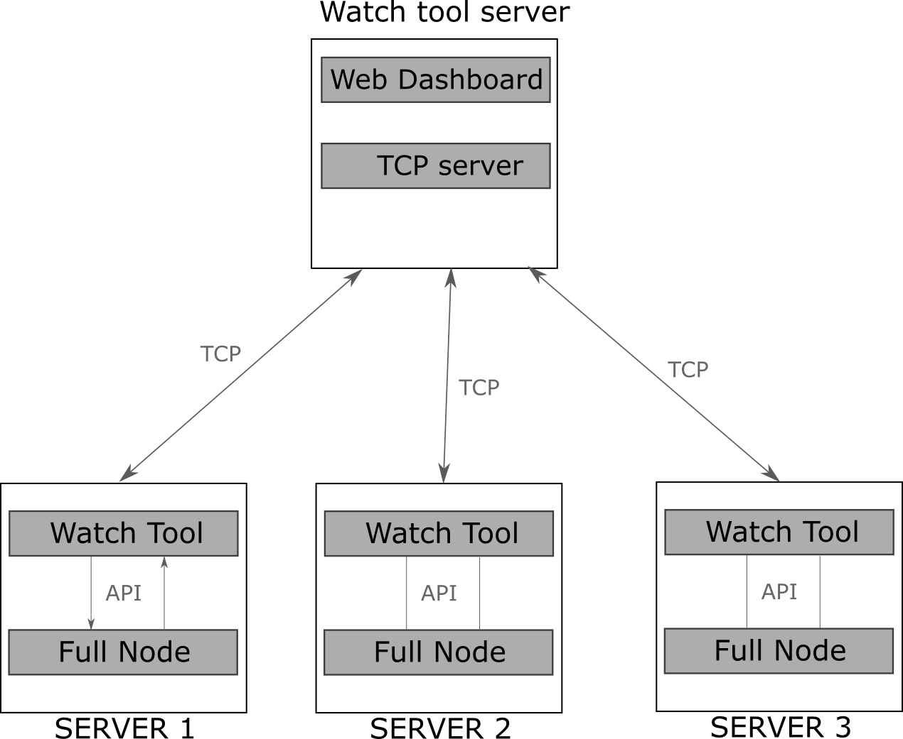

# Nodes watcher tool proposal

### Overview

Almost every stratis team member runs a node on a VDS. This is needed in order to collect data about node's run and ensure stability of the product. 

However managing those nodes is a tedious process and it takes a while for all the members to upgrade their nodes in case a breaking change is deployed or to collect the logs from multiple nodes owned by different people. Also it's usually unknown if there was a problem with the node until owner logs in and checks it manually.

To solve this problem I propose creating a simple tool which will allow data collections and interaction with multiple nodes from a single interface. 

Features of watcher tool: 

1. Ability to update multiple nodes quickly from tool's dashboard
2. Ability to clear data folder in case of breaking changes
3. Data collection and notifications about weird behavior (node is behind explorer)

Potential features (not in MVP implementation)

1. Calculation of tx propagation median time
2. Network topology map
3. Orphanage rate calculation
4. Historical data collection
5. Ability to download logs from any node using dshboard
6. Ability to modify NLog.config for all nodes at once

### Technical details

Watch tool contains client and server app. 

Client app provides API for server to interact with the node (update the node, stop, start, clear data folder, get info).

Server app aggregates collected data to display it on the dashboard and provides tools to interact with the nodes from that dashboard.

**Estimated implementation time for MVP: 10 days.** 

 